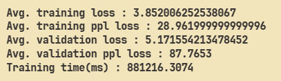
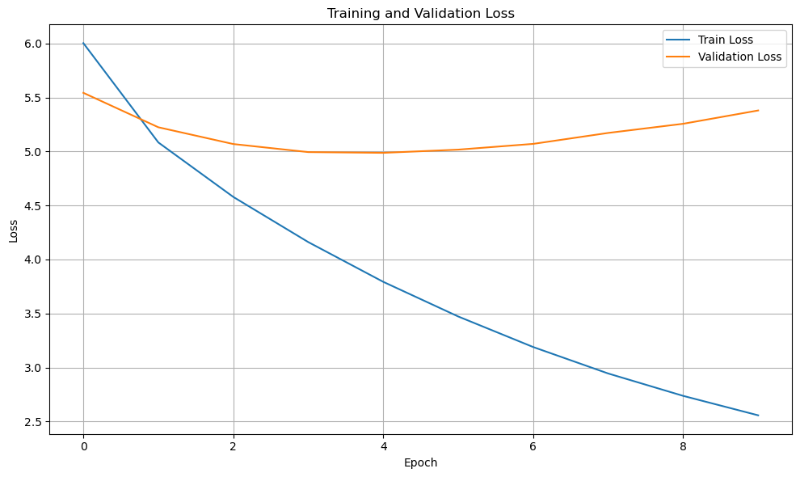
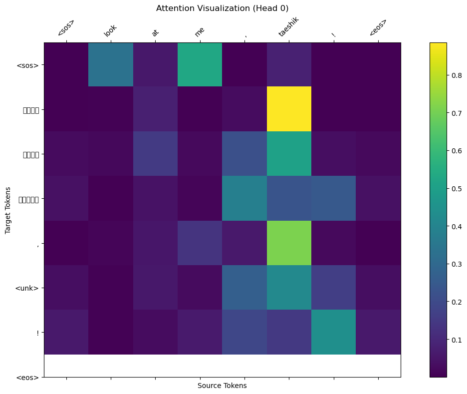

# English → Bengali Transformer

## Introduction
This repository provides a reproducible end-to-end pipeline for English → Bengali translation. It implements both Transformer (seq2seq) and RNN encoder–decoder architectures, with Luong (general) and Bahdanau (additive) attention mechanisms. The project includes data preprocessing and vocabulary tools, model implementations and training/evaluation scripts (with experimental logs/notebooks), and a minimal Flask web app to serve inference — making it easy to reproduce experiments and scale further.

## Dataset

This project uses the **OPUS-100** parallel corpus (English-centric) as the source of parallel training data for many language pairs including **bn-en**. OPUS-100 is a sampled multilingual corpus covering 100 languages and contains tens of millions of sentence pairs (≈55M sentence pairs across the set). Many language pairs have substantial data (for example, dozens of language pairs contain ≥1M sentence pairs while most have ≥10k). OPUS is the open parallel corpus collection maintained by the Helsinki NLP group. ([Hugging Face][1])

You can load the bn↔en portion using Hugging Face Datasets (example):

```python
from datasets import load_dataset
dataset = load_dataset("Helsinki-NLP/opus-100", "bn-en")
```

Hugging Face dataset page and the OPUS project pages contain full metadata and download links. [Hugging Face](https://huggingface.co/datasets/Helsinki-NLP/opus-100?utm_source=chatgpt.com)

## Results
Results of Transformer (seq2seq) (all model results are included in  jupyter notebook).

### Training Results
 
### Test Results
 
### Training and Validation Loss


### Attention token correlation



## References & links

* OPUS-100 (Hugging Face dataset): dataset card and download. [Hugging Face](https://huggingface.co/datasets/Helsinki-NLP/opus-100?utm_source=chatgpt.com)
