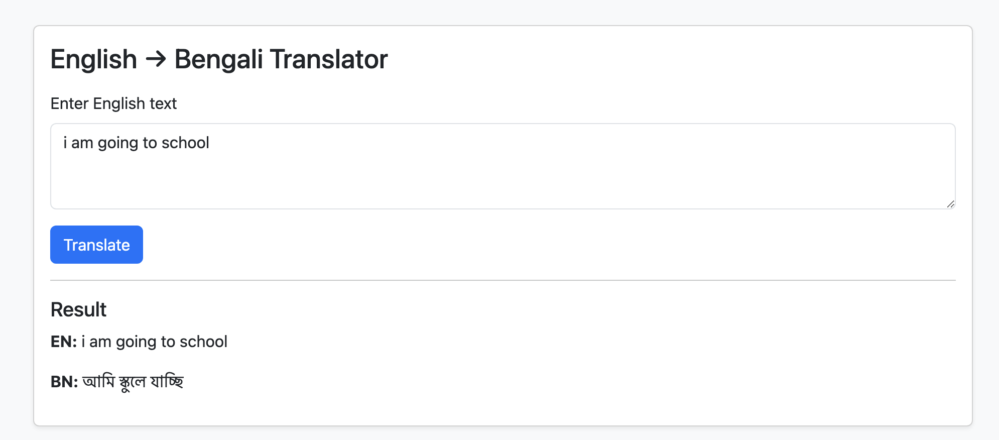

# English → Bengali Transformer

## Introduction
This repository provides a reproducible end-to-end pipeline for English → Bengali translation. It implements both Transformer (seq2seq) and RNN encoder–decoder architectures, with Luong (general) and Bahdanau (additive) attention mechanisms. The project includes data preprocessing and vocabulary tools, model implementations and training/evaluation scripts (with experimental logs/notebooks), and a minimal Flask web app to serve inference — making it easy to reproduce experiments and scale further.

## Dataset

This project uses the **OPUS-100** parallel corpus (English-centric) as the source of parallel training data for many language pairs including **bn-en**. OPUS-100 is a sampled multilingual corpus covering 100 languages and contains tens of millions of sentence pairs (≈55M sentence pairs across the set). Many language pairs have substantial data (for example, dozens of language pairs contain ≥1M sentence pairs while most have ≥10k). OPUS is the open parallel corpus collection maintained by the Helsinki NLP group. ([Hugging Face][1])

You can load the bn↔en portion using Hugging Face Datasets (example):

```python
from datasets import load_dataset
dataset = load_dataset("Helsinki-NLP/opus-100", "bn-en")
```

Hugging Face dataset page and the OPUS project pages contain full metadata and download links. [Hugging Face](https://huggingface.co/datasets/Helsinki-NLP/opus-100?utm_source=chatgpt.com)

## Results
Results of the Transformer (seq2seq) model (all model results are included in the Jupyter notebook).

### Training Results
 
### Test Results
 
### Training and Validation Loss


### Attention token correlation


Training loss falls steadily (to ≈2.6) while validation loss rises (~5.0) and test perplexity is very high (~140), and the attention heatmap shows noisy alignments — overall the model is overfitting the small training sample and yields only modest translation quality.To enhance generalization, we have to utilize more training data, implement subword tokenization methods (SentencePiece/BPE), and incorporate regularization techniques along with hyperparameter tuning. 

## Folder structure
```
.
├─ app/
│  ├─ web_app.py  
│  └─ saved_models/
│     └─ transformer_checkpoint.pt
├─ RNN_with_attentions.ipynb
├─ transformer.ipynb
├─ README.md                         
└─ requirements.txt                  
```
## Installation & quick start
Open a terminal (macOS/Linux) or Anaconda Prompt / PowerShell (Windows) and run these commands:
1. Create & activate environment

```bash
conda create -n mt_env python=3.10 -y
conda activate mt_env
```
2. Install dependencies

```bash
pip install -r requirements.txt
python -m spacy download en_core_web_sm
```
3. Run the Flask app

Make sure your environment is active, then change into the app folder and start the server. Replace the path below with the actual path to your `machine_translation/app` folder if it's not in the current directory.

```bash
# from project root
cd machine_translation/app

# or from anywhere using an absolute path
# cd /full/path/to/machine_translation/app

# start the app
python web_app.py
```
Notes
* The app will print a message like `Running on http://127.0.0.1:5000/` — open that URL in your browser.
* To stop the server, press `Ctrl+C` in the terminal.

## Limitations
* **Small training data used in experiments.** For this demo I trained and tested on a small sample from OPUS-100 because of limited compute. This yields functional but modest translation quality — more compute and data are needed for production-level performance.
* **Tokenization strategy.** The current code uses word/token-level splitting for demonstration. In practice, **subword (BPE/SentencePiece)** or sentence tokenization strategies (and proper normalization) greatly improve coverage and model accuracy.

# Flask Demo


## References & links

* OPUS-100 (Hugging Face dataset): dataset card and download. [Hugging Face](https://huggingface.co/datasets/Helsinki-NLP/opus-100?utm_source=chatgpt.com)
